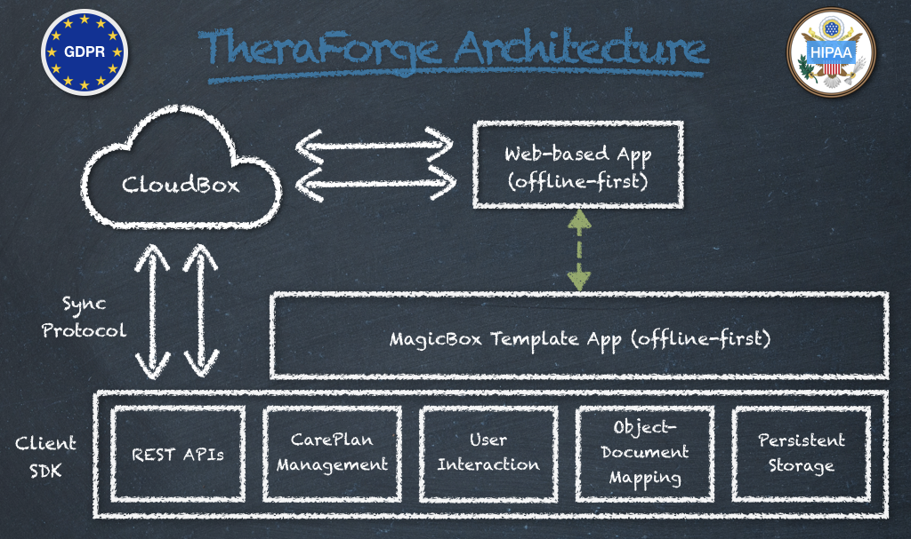
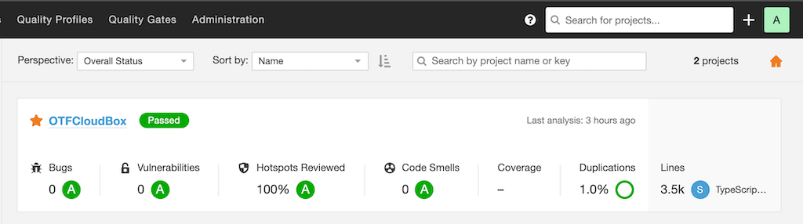
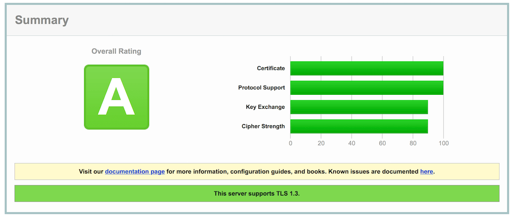

# Getting Started Documentation

# Table of Contents
* [Overview](#Overview)
* [Getting Started](#GettingStarted)
* [Features](#Features)
* [Installation](#Installation)
* [License](#License)

# Overview

**TheraForge** is an *open low-code* SDK for the *rapid application development (RAD)* of digital health solutions running on Apple iOS for the iPhone and Apple Watch.

It provides support for **offline-first** storage integrated with a **secure enterprise-grade BaaS (Backend-as-a-Service)**, which provides cloud connectivity, storage and synchronization to the apps.

It's the result of 1+ years of development and incorporates **250K+ lines of code** distributed into **7 frameworks**, with an associated **no-code template app**:

* A cloud client framework for interconnection to TheraForge’s CloudBox **serverless service (BaaS)**: [OTFCloudClientAPI](../../../OTFCloudClientAPI)
* Enterprise-grade digital health frameworks: [OTFCareKit](../../../OTFCareKit), [OTFResearchKit](../../../OTFResearchKit)
* Enterprise-grade persistent storage and synchonization frameworks: [OTFCloudantStore](../../../OTFCloudantStore), [OTFCDTDatastore](../../../OTFCDTDatastore)
* A templating framework for app customization and styling: [OTFTemplateBox](../../../OTFTemplateBox)

* A sample cloud-enabled app can be installed, used as development model and customized for **no-code prototyping**.

The client SDK also integrates with a **web-based dashboard** for medical data collection and display, patient/doctor interaction and virtual care management.
 
 
The overall architecture is described in the following figure:
 
 

# Getting Started Guide

You can start using TheraForge for free and even contribute to its development on GitHub by opening issues and submitting pull requests.

TheraForge's main components are:

1. A powerful modular SDK for app development called [ToolBox](../../../OTFToolBox).
2. A multi-cloud backend service called CloudBox (see the [Cloud Setup](../../../OTFToolBox) section).
3. A web-based doctor/patient dashboard.
4. An analytics portal to review server- and client-related statistics.
5. A no-code template app called [MagicBox](../../../OTFMagicBox).

Hippocrates Technologies provides free and paid tiers for the use of the BaaS service. Request a quote for personalized projects and for co-development opportunities. You can use the *TheraForge Client Registration form* for your queries:

**[Submit a request](https://docs.google.com/forms/d/e/1FAIpQLSfYDEx-Cnja_YE6iUFs08pxxLThlV76TAJ2uB7ymuUXbky9iA/viewform)**

**Note: To create a cloud account to use with ToolBox or MagicBox (as described in the Cloud Setup section linked above), you can use the registration form to obtain an API key.**

# TheraForge Features 

TheraForge supports the following features:

* No-code app and portal customization and configuration
* Automatic data storage in the cloud
* *Offline-first* local storage (not just a cache)
* Multi-device cloud-based synchronization
* Robust data versioning
* Support for dark mode, dynamic font sizes, high contrast, and other accessibility features
* App onboarding
* Informed consent
* Surveys
* Medical task-based assessments
* Virtual care/tele-medicine capabilities for remote care plan management
* Adherence tracking
* Standard UI cards and styles
* Monitoring of health data
* External IoT sensor support
* FHIR support
* Dependency manager support
* Notification protocol based on Server-Sent Events (SSE) technology
* *HIPAA and GDPR compliant* encryption at rest and in flight (TLS 1.3-only with Forward Secrecy)
* *HIPAA and GDPR compliant* authentication
* Sign in with Apple and with Google
* Passwordless sign-in based on TouchID or FaceID
* Analytics dashboard
* Automatic and manual code security analysis (see report in the figure below)
 
The code is analyzed and tested for security vulnerabilities and the use of TLS 1.3 with forward secrecy is verified:
 
 

See also:

[MagicBox Features](../../../OTFMagicBox#Features)

[ToolBox Features](../../../OTFToolBox#Features)

# Installation 

To install MagicBox or ToolBox, you can refer to the dedicated installation sections:

[MagicBox Installation](../../../OTFMagicBox#Installation)

[ToolBox Installation](../../../OTFToolBox#Installation)

For a newbie, MagicBox is the perfect starting point.

# License 

This project is made available under the terms of a modified BSD license. See the [LICENSE](../../../OTFToolBox/blob/main/LICENSE.md) file.
