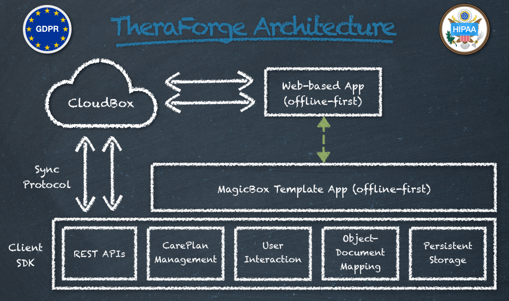

# Getting Started Documentation

# Table of Contents

1. [Introduction](#introduction)
2. [Technology Advantages](#rad-benefits)
    - [Time Savings](#time-savings)
    - [Cost Savings](#cost-savings)
3. [Reasons to Use TheraForge](#reasons-to-use-theraforge)
    - [Technology Advantages](#technology-advantages)
    - [TheraForge Benefits](#theraforge-benefits)
4. [CareKit](#carekit)
5. [ResearchKit](#researchkit)
6. [OTFToolBox](#otftoolbox)
7. [OTFDesignSystem](#otfdesignsystem)
8. [OTFTemplateBox](#otftemplatebox)
9. [OTFMagicBox](#otfmagicbox)
10. [OTFUtilities](#otfutilities)
11. [Security](#security)
12. [Installation](#installation)
13. [Conclusion](#conclusion)
14. [License](#license)

# Introduction

TheraForge is an *open **low-code SDK*** and an *offline-first **Backend-as-a-Service (BaaS)*** designed for the rapid application development (RAD) of digital health solutions on Apple iOS for *iPhone and Apple Watch*.

TheraForge streamlines the creation of healthcare applications by providing a comprehensive suite of tools and frameworks, enabling developers to focus on delivering value without being bogged down by complex coding tasks.

Support for *web apps (beta)* and *Android apps (future)* ensures versatility across platforms. IoT device integration enables seamless health data collection directly on mobile devices, and the BaaS includes a data lake for scalable data collection and storage.

TheraForge is the aggregrate result of several years of development and incorporates **250K+ lines of code** distributed into **various frameworks** (listed below), with an associated **no-code template app**.

The client SDK also integrates with a **web-based dashboard** for medical data collection and display, patient/doctor interaction and virtual care management.
 
 
The overall architecture is described in the following figure:
 
 

# RAD Benefits

Using rapid application development (RAD) technologies such as TheraForge in digital health mobile development can achieve significant savings by streamlining processes and reducing manual coding efforts:

### Time Savings

1. **Accelerated Development Cycles**: Pre-built frameworks and components can reduce development time by up to 50–70%, compared to building solutions from scratch.
2. **Rapid Prototyping**: Low-code and templating frameworks allow developers to create functional prototypes in days instead of weeks or months.
3. **Cross-Platform Support**: With support for iOS, web apps (beta), and Android apps (future), development efforts are consolidated, avoiding duplicate work for multiple platforms.
4. **Streamlined Testing and Debugging**: Pre-tested components and integrated tools reduce time spent on debugging and quality assurance.

### Cost Savings

1. **Reduced Developer Hours**: Leveraging low-code tools minimizes the amount of manual coding required, leading to lower developer hours and costs.
2. **Smaller Development Teams**: With RAD technologies, a smaller team can accomplish what would traditionally require a larger team of developers, designers, and testers.
3. **Reduced Maintenance Costs**:  Built-in features like offline-first capabilities, conflict resolution, and automated synchronization reduce the need for ongoing maintenance and troubleshooting.
4. **Lower Infrastructure Costs**: Scalable BaaS and data lake solutions eliminate the need for custom-built backend systems, significantly lowering operational and hosting costs.

# Getting Started Guide

You can start using TheraForge for free and even contribute to its development on GitHub by opening issues and submitting pull requests.

TheraForge's main components are:

1. A powerful modular SDK for app development called [ToolBox](../../../OTFToolBox).
2. An optimized Design System framework and design objects.
3. A multi-cloud backend service called CloudBox (see the [Cloud Setup](../../../OTFToolBox#theraforge-cloud-setup) section).
4. A web-based doctor/patient dashboard.
5. An analytics portal to review server- and client-related statistics.
6. A no-code template app called [MagicBox](../../../OTFMagicBox).

Hippocrates Technologies provides free and paid tiers for the use of the BaaS service. Request a quote for personalized projects and for co-development opportunities. You can use the *TheraForge Client Registration form* for your queries:

**[Submit a request](https://docs.google.com/forms/d/e/1FAIpQLSfYDEx-Cnja_YE6iUFs08pxxLThlV76TAJ2uB7ymuUXbky9iA/viewform)**

**Note: To create a cloud account to use with ToolBox or MagicBox (as described in the Cloud Setup section linked above), you can use the registration form to obtain an API key.**

# Reasons to Use TheraForge

### Technology Advantages

- **Optimized Design System Supporting Accessibility Technologies**: Ensures consistent, user-friendly designs compatible with accessibility tools.
- **Accelerated Development**: Leverage pre-built frameworks to significantly reduce development time.
- **Enterprise-Grade Solutions**: Access robust, secure, and scalable components suitable for professional healthcare applications.
- **Offline-First Capability**: Ensure seamless user experiences with offline data storage and synchronization.
- **Customization and Flexibility**: Utilize templating frameworks for easy app customization and styling.
- **Integration with Apple Ecosystem**: Develop applications tailored for iPhone and Apple Watch, tapping into their advanced features.
- **Data Security**: Take advantage of quantum-safe end-to-end encryption to ensure user data is secure at all times.
- **Cross-Platform Potential**: Expand your application’s reach with support for web apps (beta) and Android apps (future).
- **IoT Device Support**: Collect health data from IoT devices directly on mobile platforms, enabling advanced monitoring and analytics.

### TheraForge Benefits

- **Reduced Development Time**: Pre-built components and frameworks expedite the development process.
- **Enhanced Collaboration**: Low-code environment allows both developers and less experienced contributors to participate effectively.
- **Cost Efficiency**: Minimize resource expenditure by leveraging existing frameworks and reducing the need for extensive coding.
- **Improved Application Quality**: Utilize tested and proven components to enhance app reliability and performance.
- **Scalability**: Easily scale applications to meet growing user demands without significant redevelopment.
- **Offline Availability**: Enable continuous functionality regardless of internet connectivity, ensuring a seamless user experience.
- **Data Privacy**: With quantum-safe end-to-end encryption, maintain strict compliance with data protection regulations and safeguard user information.
- **Cross-Platform Adaptability**: Develop applications for iOS, with expanding support for web apps (beta) and Android apps (future).
- **Efficient Data Replication**: Benefit from seamless replication capabilities, ensuring that data remains synchronized across devices and locations.
- **Conflict Resolution**: Enjoy automated conflict resolution to maintain data integrity during synchronization.
- **IoT Integration**: Leverage the ability to collect and process data from IoT devices for comprehensive health insights.
- **Data Lake Capability**: Use the built-in BaaS data lake for scalable storage and analysis of extensive datasets, ensuring robust data management.

### TheraForge Features

- **Offline-First BaaS**: TheraForge’s CloudBox provides serverless cloud connectivity, storage, and multi-device synchronization with offline-first capabilities (not just a cache!) and event management.
- **End-to-End Encryption**: Ensure sensitive user data remains secure during transmission and storage with quantum-safe **HIPAA and GDPR compliant** encryption at rest and in flight (TLS 1.3-only with Forward Secrecy).
- **Digital Health Frameworks**: Access enterprise-grade frameworks like CareKit and ResearchKit for health-related functionalities.
- **Persistent Storage and Synchronization**: Implement reliable data storage and synchronization with frameworks such as OTFCloudantStore and OTFCDTDatastore.
- **Templating Framework**: Customize app design and functionality effortlessly using OTFTemplateBox.
- **Sample Cloud-Enabled App**: Utilize a sample app as a development model for no-code prototyping and customization.
- **Platform Expansion**: Build for iOS and prepare for web apps (beta) and Android apps (future) to reach a wider audience.
- **Advanced Synchronization**: Take advantage of advanced synchronization features, including efficient replication and conflict resolution, for seamless data consistency.
- **Scalable Architecture**: Rely on a distributed, scalable architecture to handle high volumes of data and users efficiently.
- **IoT Device Integration**: Connect IoT devices for real-time or batch health data collection on mobile applications.
- **BaaS Data Lake**: Utilize a scalable data lake for storing, managing, and analyzing large health datasets, supporting extensive analytics and reporting needs.
- App support for dark mode, dynamic font sizes, high contrast, and other **accessibility features**
- **App onboarding**
- Informed **consent** management
- **Surveys**
- Medical **task scheduling**
- Virtual care/tele-medicine capabilities for **remote care plan management**
- **Adherence tracking**
- Premade UI cards and styles
- Monitoring of health data
- **App logger** for easier troubleshooting
- **FHIR support**
- Dependency manager support
- **Notification protocol** based on Server-Sent Events (SSE) technology
- **Sign in with Apple and with Google**
- **Passwordless sign-in** based on **TouchID or FaceID**
- Analytics dashboard
- Automatic and manual code security analysis (see report in the figure below)

**Much more still to come...**

# List of Components

## CareKit

OTFCareKit is a fork of Apple's CareKit, providing an open-source framework for creating apps that help users better understand and manage their health. It offers modules that can be used out of the box or customized for specific use cases. [Learn more](https://github.com/TheraForge/OTFCareKit).

## ResearchKit

OTFResearchKit is a fork of Apple's ResearchKit, an open-source framework that simplifies creating apps for medical and other research projects. It provides tools for obtaining informed consent, conducting surveys, and performing active tasks. [Learn more](https://github.com/TheraForge/OTFResearchKit).

## OTFToolBox

OTFToolBox serves as TheraForge's umbrella framework, incorporating various sub-frameworks to facilitate rapid application development of digital health solutions on iOS. It streamlines the integration of multiple components necessary for building comprehensive health applications. [Learn more](https://github.com/TheraForge/OTFToolBox).

## OTFDesignSystem

OTFDesignSystem is TheraForge's design system tailored for iOS apps, providing a cohesive set of design guidelines and components. It ensures consistency and ompatibility with accessibility technologies, enhancing the user experience across digital health applications. [Learn more](https://github.com/TheraForge/OTFDesignSystem).

## OTFTemplateBox

OTFTemplateBox is a fully customizable zero-code template framework that enables app customization. It allows developers to modify app designs and functionalities effortlessly, facilitating rapid prototyping and deployment. [Learn more](https://github.com/TheraForge/OTFTemplateBox).

## OTFUtilities

OTFUtilities is TheraForge's utility framework that provides various helper functions, including end-to-end encryption. It enhances security and simplifies common tasks within digital health applications. [Learn more](https://github.com/TheraForge/OTFUtilities).

## OTFMagicBox

OTFMagicBox is a **zero-code template app** demonstrating how to use TheraForge's APIs. It serves as a model for fast prototyping, allowing developers to quickly build and test digital health solutions. [Learn more](https://github.com/TheraForge/OTFMagicBox).

# Security

TheraForge prioritizes data security with quantum-safe end-to-end encryption. All user data is secured during transmission and storage, ensuring compliance with the highest data protection standards. The platform also supports secure authentication mechanisms, audit trails, and robust access controls to safeguard sensitive health information.

The code is analyzed and tested for security vulnerabilities and the use of TLS 1.3 with forward secrecy is verified:
 
 

See also:

[MagicBox Features](../../../OTFMagicBox#Features)

[ToolBox Features](../../../OTFToolBox#Features)

# Installation

To install MagicBox or ToolBox, you can refer to the dedicated installation sections:

[MagicBox Installation](../../../OTFMagicBox#Installation)

[ToolBox Installation](../../../OTFToolBox#Installation)

For a newbie, **MagicBox is the perfect starting point!**

For further assistance, visit the respective GitHub repositories linked in the framework descriptions.

# Conclusion

By using RAD technologies like TheraForge, healthcare organizations can accelerate time-to-market, reduce upfront and ongoing costs, and focus their resources on delivering innovative, secure, and high-quality solutions tailored to their users' needs. This makes RAD an ideal approach for the rapidly evolving digital health landscape.

*Note: The information provided is based on the available data from the TheraForge GitHub repository and related sources.*

# License

This project is made available under the terms of a modified BSD license. See the [LICENSE](../../../OTFToolBox/blob/main/LICENSE.md) file.

